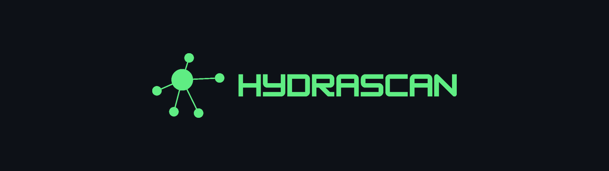

<p align="center">
  
</p>

<p align="center">
  Graph-native supply-chain blast-radius analysis, powered by
  <a href="https://github.com/hydra-db/hydradb">HydraDB</a>.
</p>

<p align="center">
  <a href="https://hydrascan.shadrakbessanh.me">Live demo</a> ·
  <a href="https://www.npmjs.com/package/hydrascan">npm</a> ·
  <a href="https://pypi.org/project/hydrascan/">PyPI</a> ·
  <a href="https://github.com/apps/hydrascan">GitHub App</a>
</p>

## What it does

When an npm package is compromised, as in the August 2026 `keyv` / Shai-Hulud
incident that affected 400+ packages, the question that matters is not
"is this package vulnerable?" but **"is my project actually reachable from it,
and through which path?"**

Most projects pull in hundreds of packages transitively without ever choosing
them directly. A compromised package is usually buried deep in the dependency
tree. HydraScan models the full dependency tree as a graph, cross-references it
with known advisories, and computes the reachable set: which of your
applications are actually exposed, and the exact attack path to each of them.

## Powered by the HydraDB graph engine

Following transitive dependency chains is a graph traversal. A flat vulnerability
list can tell you a package is compromised; only a graph can tell you the path
`your-app → eslint → file-entry-cache → flat-cache → keyv`.

HydraScan writes the dependency graph into the HydraDB graph engine and computes
the blast radius **inside HydraDB** using its native shortest-path procedure
(`algo.SPpaths`) over OpenCypher. HydraDB is the reachability engine, not a
passive store. If no engine is reachable, HydraScan falls back to a local
traversal so it always produces a result.

## Dependency reachability, not code reachability

Modern SCA tools reduce false positives with call-graph reachability, proving a
vulnerable *function* is actually invoked. That is the right model for classic
CVEs, but the wrong model for supply-chain malware. A compromised package like
`keyv` runs its payload from an install-time `preinstall` hook: it executes
because it is present in the install tree, regardless of whether your code ever
calls it. HydraScan therefore computes **dependency reachability**, is a
compromised package present on a path from your project, which is exactly the
signal that matters for install-time malware.

## Dependency resolution

- With a committed `package-lock.json`, the exact pinned tree is used (npm).
- Without one, the transitive tree is reconstructed from `package.json` or
  `requirements.txt` via the [deps.dev](https://deps.dev) resolved-graph API, so
  any npm or PyPI repository can be scanned.
- Advisories come from [OSV.dev](https://osv.dev), queried per exact version.

## Beyond the blast radius

For npm, HydraScan also reports the questions a real incident raises: which
compromised packages **share a maintainer** or **source repository** (the worm
pattern), and which dependency names are likely **typosquats**.

## Surfaces

The same HydraDB-powered scan is exposed three ways.

### Web

Paste a repository URL at **[hydrascan.shadrakbessanh.me](https://hydrascan.shadrakbessanh.me)**
and explore the dependency graph, the exposure score, every reachable compromised
package, and the fixes.

### CLI

The CLI talks to the hosted API, so no local engine setup is needed. It exits `1`
when a compromised dependency is reachable (`0` when clean), so it drops straight
into CI.

```bash
npx hydrascan sindresorhus/got     # npm, no install
pip install hydrascan              # PyPI
hydrascan                          # scan the current directory (npm + PyPI)
```

It accepts a repo URL, an `owner/repo` shorthand, or a local lockfile path, and
supports `--json` for automation.

### GitHub App

Install **[the HydraScan app](https://github.com/apps/hydrascan)** on a repository
and it reviews every pull request on its own, no workflow file. It comments with
the reachable compromised dependencies and their fixes, and sets a status check
that can block the merge.

## Running the full stack locally

Start a HydraDB engine (any instance works):

```bash
docker run --rm -p 8443:8443 \
  -e CLOUD_PROVIDER=local -e LOCAL_PATH=/data/store \
  -e GRAPH_AUTH_TOKEN_FILE=/data/auth-token -e GRAPH_ALLOW_PLAINTEXT=true \
  -v "$PWD/hydradb-data:/data" ghcr.io/hydra-db/hydradb:latest
```

Point HydraScan at it and run the API and web app:

```bash
export HYDRADB_HTTP_URL=http://127.0.0.1:8443
export HYDRADB_GRAPH_TOKEN=local-development-token-32-bytes

pip install -e ".[web]"
uvicorn hydrascan.web.app:app --port 8000

cd frontend && npm install && npm run dev
```

## License

[MIT](LICENSE)
